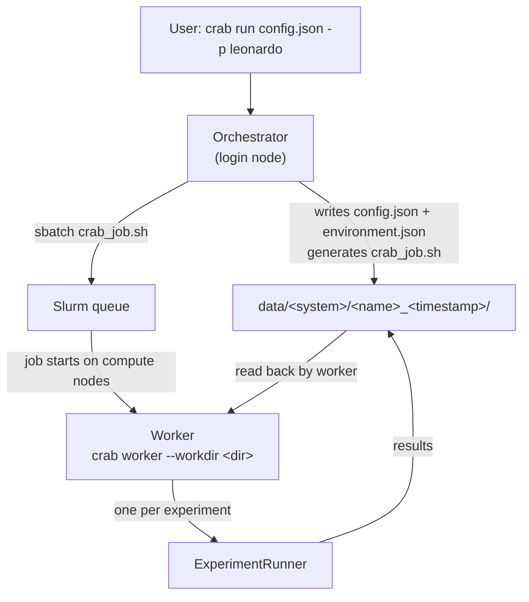
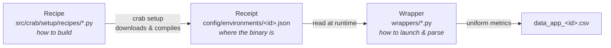

# Architecture

This page explains how CRAB is structured. Two ideas are worth internalizing before reading the
code: the **orchestrator/worker split** (how a run actually reaches the compute nodes) and the
**wrapper / recipe / receipt** model (how arbitrary applications are made runnable). Everything
else builds on these.

## High-level responsibilities

| Layer | Location | Job |
|-------|----------|-----|
| **Entry point (CLI / TUI)** | `src/crab/cli/`, `src/crab/tui/` | Collect configuration, choose a preset, hand off to the engine. |
| **Engine** | `src/crab/core/engine.py` | The control core. Runs in one of two modes (orchestrator or worker). |
| **Experiment runner** | `src/crab/core/experiment/runner.py` | Drives a single experiment: load apps, allocate nodes, run, check convergence, save data. |
| **Workload manager** | `src/crab/core/wl_manager/` | Translate "run this command on these nodes" into `srun` / `mpirun` invocations. |
| **Wrappers** | `wrappers/` | Per-application adapters: how to launch and how to parse output. |
| **Setup (recipes + receipts)** | `src/crab/setup/` | Build benchmarks and record where their binaries live. |

## The two-phase execution model

`crab run` does **not** execute your benchmarks directly. A run is split across two separate
processes, both implemented by the `Engine` class:

**Phase 1 — Orchestrator** (`Engine._run_orchestrator`, runs on the login node):

1. Loads the selected **preset** and merges its environment, Slurm directives, and shell header.
2. Loads all benchmark **receipts** (and injects each as a `CRAB_PATH_<ID>` environment variable).
3. Creates a timestamped data directory and writes `config.json` + `environment.json` into it.
4. Generates `crab_job.sh` with the computed `#SBATCH` headers.
5. Submits it with `sbatch`. The job's payload is `crab worker --workdir <data_dir>`.

**Phase 2 — Worker** (`Engine._run_worker`, runs on the allocated compute nodes):

1. Reads `config.json` / `environment.json` back from the data directory.
2. Injects the framework environment and expands `$SLURM_NODELIST` into a concrete node list.
3. Runs each experiment in turn through an `ExperimentRunner`.

!!! info "The handoff is the filesystem"
    The orchestrator and worker never share memory — they communicate **only** through the files
    written into the data directory. That directory is both the input contract for the worker and
    the output location for results, which is why a CRAB run is fully reproducible from its folder.

!!! warning "Slurm is on the critical path"
    The orchestrator always submits via `sbatch`. The preset's `CRAB_WL_MANAGER` setting
    (`slurm` vs `mpi`) only chooses how *individual applications* are launched **inside** the
    worker — `srun` (`wl_manager/slurm.py`) or `mpirun` (`wl_manager/mpi.py`). It does not provide
    an alternative to Slurm for submitting the job itself.

## The wrapper / recipe / receipt model

This is how "any application can be run" without modifying the framework. Three distinct concepts
collaborate — keep them separate in your mind:

### Wrapper

A Python module in `wrappers/` containing a class literally named `app` that subclasses `base`
(`src/crab/wrappers/base.py`). It defines:

- `metadata` — a list of metric descriptors, each `{"name": ..., "unit": ..., "conv": ...}`
  (`conv` marks a metric as a convergence target).
- `get_binary_path()` — the absolute path to the executable (often read from a receipt or a
  `CRAB_PATH_*` environment variable).
- `read_data()` — parses `self.stdout` and returns a **list of lists**: one inner list of samples
  per metric, in the same order as `metadata`.

Wrappers are loaded dynamically *by file path* at experiment setup time, so adding a benchmark
requires no changes to the core.

### Recipe

A class in `src/crab/setup/recipes/` subclassing `BenchmarkRecipe`. It describes how to
**download and build** a benchmark (clone, compile, locate the binary). Recipes are auto-discovered
by `setup/registry.py` and are used only by the `crab setup` wizard.

### Receipt

A JSON file at `config/environments/<benchmark_id>.json`, managed by `setup/memory.py`. It is the
**output of building a recipe** and the **input the wrapper reads at runtime**, recording:

- `binary_path` — where the built executable lives.
- `hooks.pre_run` — shell commands to run before launching the application.
- `launcher_override` — a launcher to use instead of the cluster default.
- `target_arch` — e.g. `gpu`, used for a guardrail check against the requested partition.

The `config/environments/` directory does not exist until `crab setup` creates it.

## Per-experiment lifecycle

Inside the worker, `ExperimentRunner` manages one experiment at a time:

1. **`setup()`** — load the wrappers, select the workload manager, allocate nodes
   (`core/allocation/allocator.py`), and build a `DataContainer` per collected metric.
2. **`execute()`** — repeat the experiment from `minruns` up to `maxruns`. Each run drives an
   event loop that starts/stops applications on schedule, polls their processes, and resolves
   "start after app N finishes" dependencies. After `minruns`, the loop stops early once metrics
   reach **statistical convergence** (`core/data/utils.py::check_CI` — the confidence-interval
   width falls below `beta × mean`).
3. **`save_results()`** — write per-application CSV (or HDF) files.
4. **`teardown()`** — guarantee every process is killed before the next experiment.

A single application launch (`core/process/manager.py::run_job`) writes a per-app bash script
under `<run_dir>/.wrappers/`, sources the cluster's module system, runs any `pre_run` hooks, and
then executes the workload-manager-built launch command, draining stdout on a background thread.

### Node allocation strategies

The allocator maps the job's node list onto the applications according to `allocationmode`:

- **Linear (`l`)** — contiguous blocks of nodes per application.
- **Interleaved (`i`)** — nodes assigned round-robin across applications.
- **Partitioned (`p`)** — nodes split into victim/aggressor *partitions* (by each app's
  `partition_id`), with independent placement rules inside each partition.

## Output layout

Results are written under `data/<CRAB_SYSTEM>/<name>_<timestamp>/`:

- Run-level provenance: `config.json`, `environment.json`, `crab_job.sh`, `slurm_output.log`,
  `slurm_error.log`.
- Per experiment: `<experiment>/data_app_<id>.csv` (or `.h5`), `error_app_<id>.log`, and per-run
  `run_<n>/.wrappers/` launch scripts.
- A system-level `metadata.csv` registry, appended atomically with file locking so concurrent
  CRAB jobs on a shared filesystem don't corrupt it.
