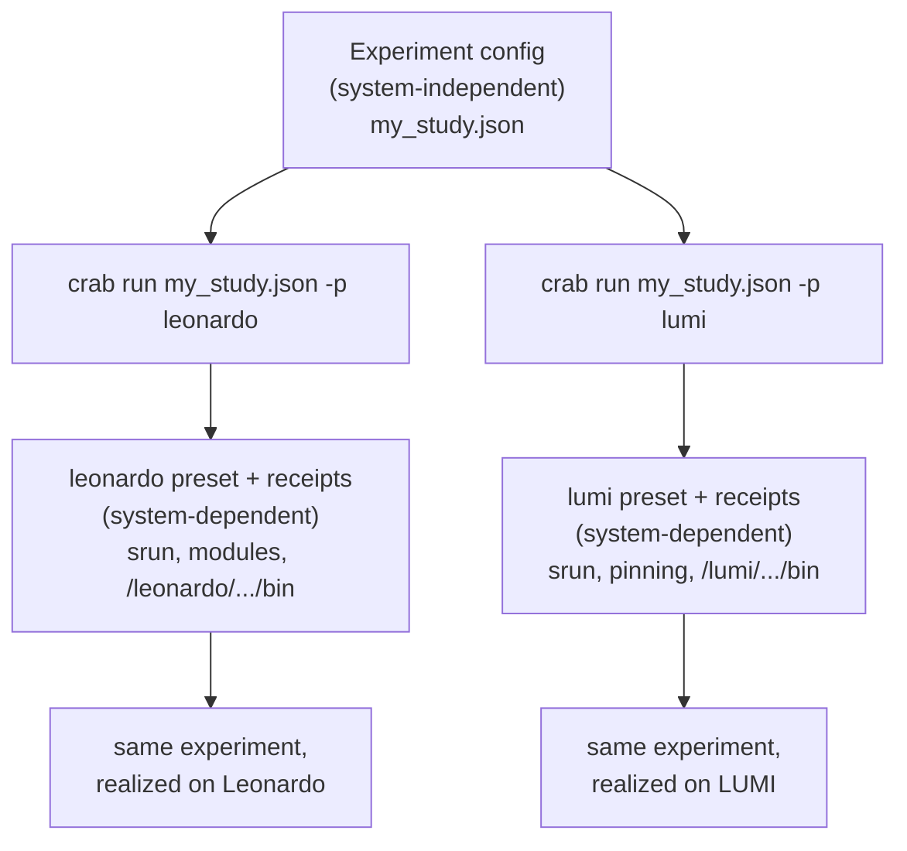

# System-dependent vs system-independent

The single most important idea in CRAB is a separation of concerns: **what** you want to measure
is kept apart from **how a particular machine runs it**. Internalize this split and the rest of
the framework — presets, receipts, wrappers, the orchestrator/worker dance — falls into place.

## The two halves

| | System-**independent** | System-**dependent** |
|---|---|---|
| **Question it answers** | *What do I want to run and measure?* | *How does **this** cluster build and launch it?* |
| **Examples** | which applications, their arguments, node allocation, scheduling, how many runs, what to collect | binary locations, module loads, launcher (`srun`/`mpirun`), CPU pinning, Slurm account/partition, environment variables |
| **Where it lives** | the **experiment config** (`*.json`) and the parsing logic inside a **wrapper** | **presets** (`config/presets.json`) and **receipts** (`config/environments/*.json`) |
| **Travels between machines?** | ✅ Yes — commit it, share it, reproduce it anywhere | ❌ No — it describes one specific system |
| **Who provides it** | the person designing the benchmark study | configured once per cluster (and per build) |

## Why the split exists

Because the two halves change for completely different reasons. Your *experiment* — "run an
all-to-all victim against a Graph500 aggressor on 8 nodes, 50/50 partitioned, until the bandwidth
converges" — is a scientific question. It does not change when you move from one supercomputer to
another. But *how* that experiment is realized — `srun` vs `mpirun`, which modules to load, where
the compiled binary sits, how to pin ranks to cores — changes completely between machines.

Keeping them separate buys you two things:

- **Portability.** The same experiment config runs on Leonardo, LUMI, or your department cluster.
  You change only the preset you select (`-p leonardo`), never the experiment.
- **Reproducibility.** A config file is a complete, shareable description of a study. Someone on a
  different system can reproduce your experiment by supplying their own preset and receipts.

## The three system-dependent pieces

When you bring CRAB to a new cluster, three things — and only these three — are what you adapt:

1. **A preset** (`config/presets.json`) — the environment for that system: which workload manager
   to use, the launcher and its flags, CPU pinning, modules to load, and the Slurm directives
   (account, partition) every job needs. You select it at run time with `-p <name>`.
   See [Configuring your cluster](../using/presets.md).
2. **Receipts** (`config/environments/*.json`) — produced by running `crab setup`, which builds
   each benchmark on *this* machine and records where the resulting binary lives, plus any
   pre-run hooks or launcher overrides it needs.
3. **The workload manager binding** — `slurm` (uses `srun`) or `mpi` (uses `mpirun`), chosen by
   the preset's `CRAB_WL_MANAGER`. This only affects how individual applications are launched on
   the allocated nodes; the job itself is always submitted with `sbatch`.

## The system-independent pieces

1. **The experiment config** (`*.json`) — applications, arguments, node allocation, scheduling
   (victims and aggressors), convergence targets, and what data to collect. This is the file you
   write for each study. See the [Configuration schema](../reference/configuration.md).
2. **Wrappers** (`wrappers/*.py`) — the per-application adapters. A wrapper's *parsing logic*
   (turning program output into metrics) is system-independent; it references the
   system-dependent binary path indirectly, through a receipt, so the same wrapper works on every
   machine.

!!! tip "A useful rule of thumb"
    If a piece of information would be the same on every supercomputer in the world, it belongs in
    the experiment config or the wrapper. If it would differ between two clusters, it belongs in a
    preset or a receipt. When in doubt, ask: *"Would I have to change this just because I moved to
    a different machine?"*

For the mechanics of how these pieces are wired together at run time, see
[Architecture](architecture.md). For the precise meaning of the recurring terms, see the
[Glossary](../glossary.md).
